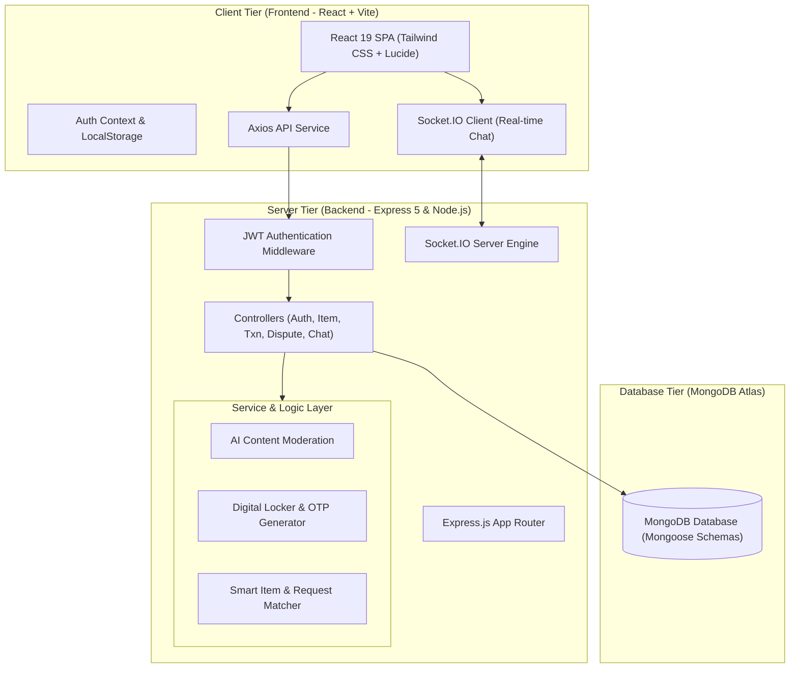
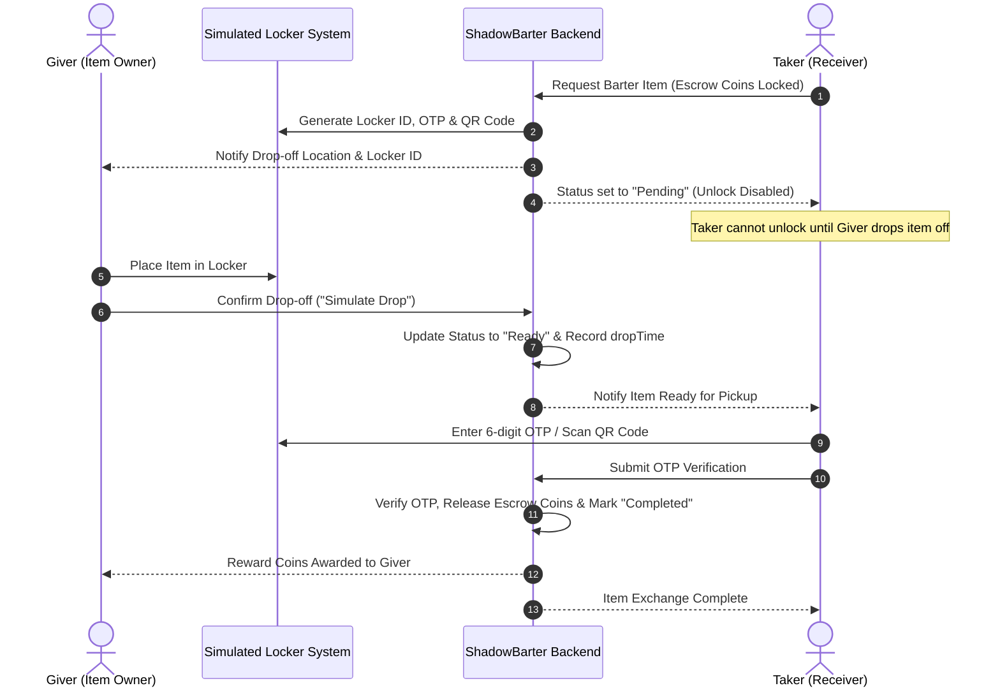

# ShadowBarter 📦🕵️‍♂️

**Privacy-First Anonymous Barter Platform for College Environments**

[](https://anonymous-barter-system.onrender.com)
[](https://opensource.org/licenses/ISC)
[](https://nodejs.org)
[](https://react.dev)
[](https://www.mongodb.com)

---

## 🌟 Overview

In today's world, our needs often define our identity. **ShadowBarter** is a privacy-first circular economy platform that enables college students to exchange items anonymously and securely without revealing personal data (no email or phone required). 

Transactions are facilitated through a **simulated digital locker handoff system** and governed by a **coin-based economy**.

---

## 🏗️ System Architecture



---

## 🔄 Digital Locker Exchange Sequence



---

## 🚀 Key Features

* 🕵️‍♂️ **Anonymous Authentication**: Zero personal data collection. Accounts generate random IDs (e.g. `User_4821`) protected by a master password.
* 🪙 **Coin Economy**: New users start with 50 coins. Earn coins by listing/donating items and spend coins to barter items.
* 🔐 **Digital Locker Exchange**: Secure two-step handoff with unique 6-digit OTP verification and QR codes.
* ⏳ **Strict Drop-off Window**: Takers are prevented from unlocking lockers until the giver completes the drop-off step.
* 🛡️ **AI Safety & Moderation**: Built-in content filter blocks restricted items (weapons, drugs, illegal goods) automatically.
* 💬 **Real-time Anonymous Chat**: WebSockets (Socket.IO) enable instant, zero-footprint messaging during active transactions.
* ⭐ **Reputation & Badges**: Automatic badge computation (*On-Time Pro*, *Quality Keeper*, *Clear Communicator*) based on transaction feedback.

---

## 🛠️ Technology Stack

| Layer | Technology |
| :--- | :--- |
| **Frontend** | React 19, Vite 8, Tailwind CSS, Framer Motion, Lucide Icons |
| **Backend** | Node.js (v22+), Express.js 5, Socket.IO 4 |
| **Database** | MongoDB Atlas, Mongoose 9 |
| **Authentication** | JWT (JSON Web Tokens), Bcryptjs |
| **Deployment** | Render Web Service (Single-port Full-Stack Production) |

---

## 🏁 Quick Start & Installation

### Prerequisites
* **Node.js**: v18 or higher
* **MongoDB**: Local MongoDB instance or MongoDB Atlas URI

### 1. Clone & Install Dependencies

```bash
git clone https://github.com/Kadambari0305/Anonymous_Barter_System.git
cd Anonymous_Barter_System

# Install all dependencies (Server + Client)
npm run install:all
```

### 2. Configure Environment Variables

Create or edit `server/.env`:

```env
PORT=5000
MONGO_URI=mongodb+srv://<user>:<password>@cluster0.mongodb.net/shadowbarter?retryWrites=true&w=majority
JWT_SECRET=your_shadowbarter_secret_key
FRONTEND_URL=http://localhost:5173
```

### 3. Run Locally

#### Production Mode (Unified Single Server)
```bash
npm run build
npm start
```
Access the application at `http://localhost:5000`.

#### Development Mode (Hot Reloading)
```bash
# Terminal 1 (Backend)
npm run dev:server

# Terminal 2 (Frontend)
npm run dev:client
```
Access the dev app at `http://localhost:5173`.

---

## ☁️ Deployment on Render

This repository includes a pre-configured `render.yaml` blueprint for 1-click deployment on Render:

1. Connect your repository to [Render.com](https://render.com).
2. Set Environment Variables: `MONGO_URI`, `JWT_SECRET`, `NODE_ENV=production`.
3. Build Command: `npm run install:all && npm run build`
4. Start Command: `npm start`

---

## 👥 Authors & Contributors

* **Siddhi Khandarkar**
* **Kadambari Marne**
